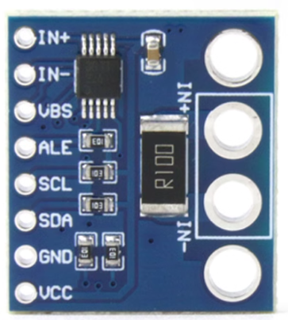
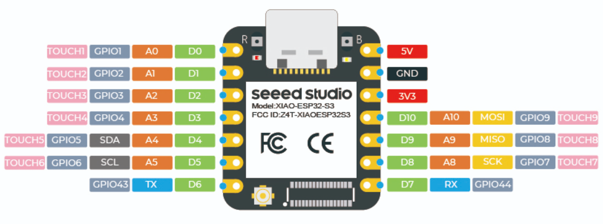
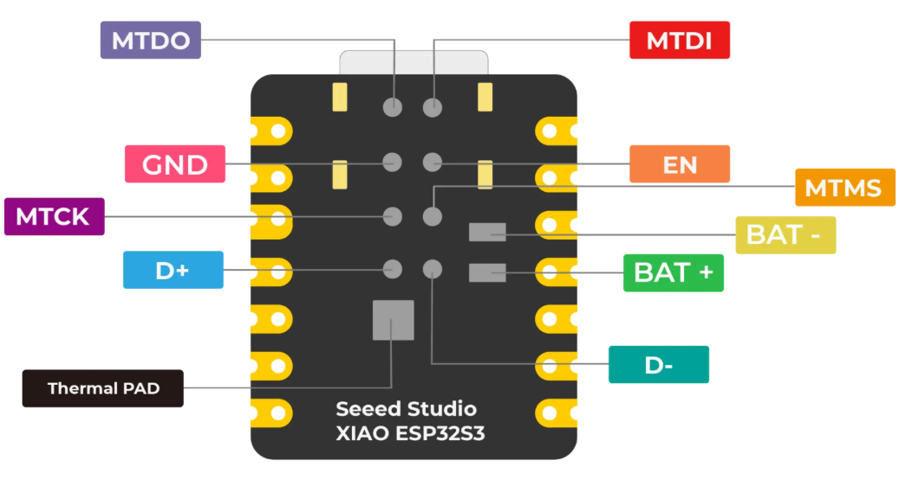
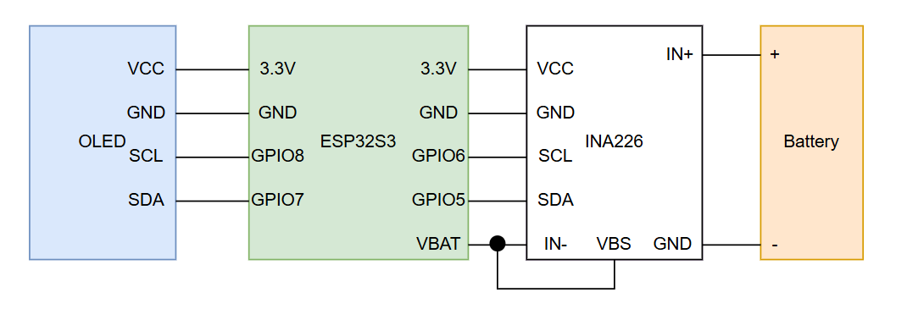
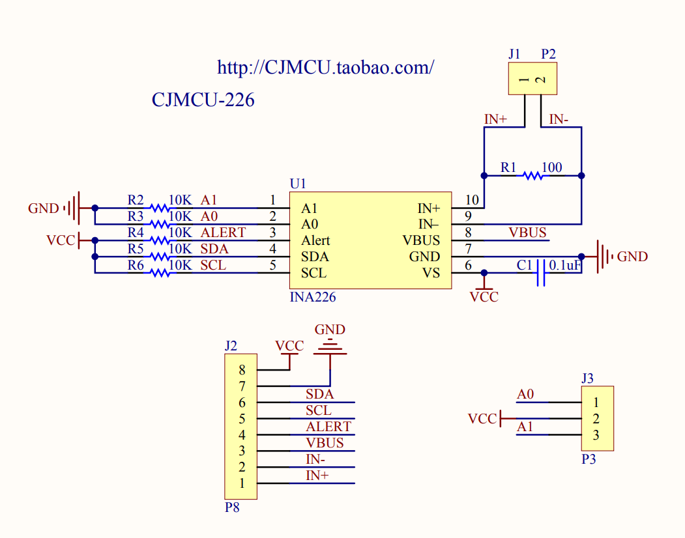

# 硬件配置
|设备|说明|
|-|-|
|ESP32S3|使用的是XIAO ESP32S3 当然也可以使用其他家的|
|INA226|从淘宝电子爱好者之家采购的|
|OLED|SSD1306OLED|
|电池|3.7V锂电池|

# 硬件连接

# INA226的电路图

在这里面发现VBS是没有和其他引脚进行连接的，所以我单独把这个VBS连接到了IN-，否则会出现读取异常的问题

# 关于代码

`INA.setMaxCurrentShunt(0.7, 0.1);`这个地方我们可以调整两个参数的值，第一个值是预计电流大小，单位是A，第二个值是采样电阻的大小，由于我使用的是模组，所以值固定在0.1欧姆。在这里我仅仅测量esp32s3工作时候的电流，参考数据手册，最大功耗都不超过100mA所以这里可以写小一点，否则你会发现读出来电流的大小趋近于0 